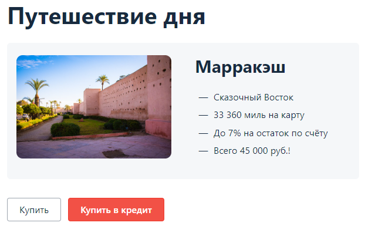

# Дипломная работа профессии «Тестировщик ПО»
## Смирновой Екатерины Викторовны

В данном проекте реализован процесс автоматизации тестирования функционала приложения [aqa-shop.jar](artifacts/aqa-shop.jar) "Путешествие дня" по карте или в кредит.
Для тестирования будет использоваться язык программирования Java.
Окружение реализовано в IntelliJ IDEA и Docker, в котором будет запущены необходимые компоненты база данных MySQL или Postgres, заглушка для сервисов на Node, и ReportPortal для создания отчетов.  

План расположен в файл [Plan.md](Plan.md)

## Начало работы

Копию проекта можно скачать с GitHub [ссылка на проект](https://github.com/katerina331/Java-AQA-55-ItogDiplom).

В проекте есть [docker-compose.yml](docker-compose.yml) с настройками для запуска окружения в Docker. В котором прописаны все необходимые настройки для MySQL, Postgres, Node и ReportPortal.

Для запуска приложения есть настройки [application.properties](application.properties). В которых прописаны связи с: сервисами; базой данных, логином, паролем; портом.

### Prerequisites

Для запуска проекта необходим установленные _Google Chrome, IntelliJ IDEA, Docker_ и _Git_. Их можно скачать по ссылкам: [Google Chrome](https://www.google.com/intl/ru_ru/chrome/), [IntelliJ IDEA](https://www.jetbrains.com/ru-ru/idea/download/), [Docker](https://www.docker.com/), [Git](https://git-scm.com/downloads).

### Установка и запуск
Устанавливаем Git.
Устанавливаем IntelliJ IDEA.
Устанавливаем Docker.

Запускаем IntelliJ IDEA. Загружаем скаченный проект [ссылка](https://github.com/katerina331/Java-AQA-55-ItogDiplom).

Настраиваем ReportPortal по [инструкции](ReportPortal Instruction.md)

Запускаем окружение командой в терминале
```
docker-compose up
```

Запускаем приложение командой в терминале
```
java -jar artifacts/aqa-shop.jar
```
После запуска в браузере по ссылке [localhost:8085](https://localhost:8085) будет доступно приложение



Все зависимости и настройки для тестирования прописаны в [build.gradle](build.gradle)

Запуск тестов выполняется командой
```
./gradlew test
```

После прохождения тестов по ссылке [localhost:8080](https://localhost:8080) на ReportPortal будет доступен отчет о тестировании.


## Лицензия

Все приложения используют лицензии для домашнего использования. Нет необходимости приобретения дополнительного ПО.